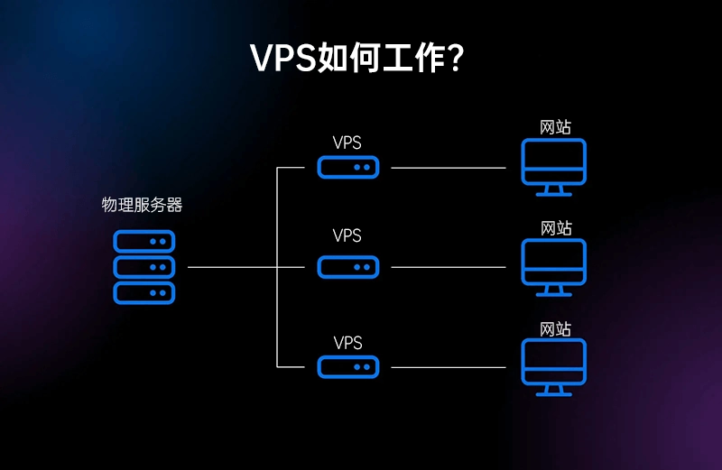
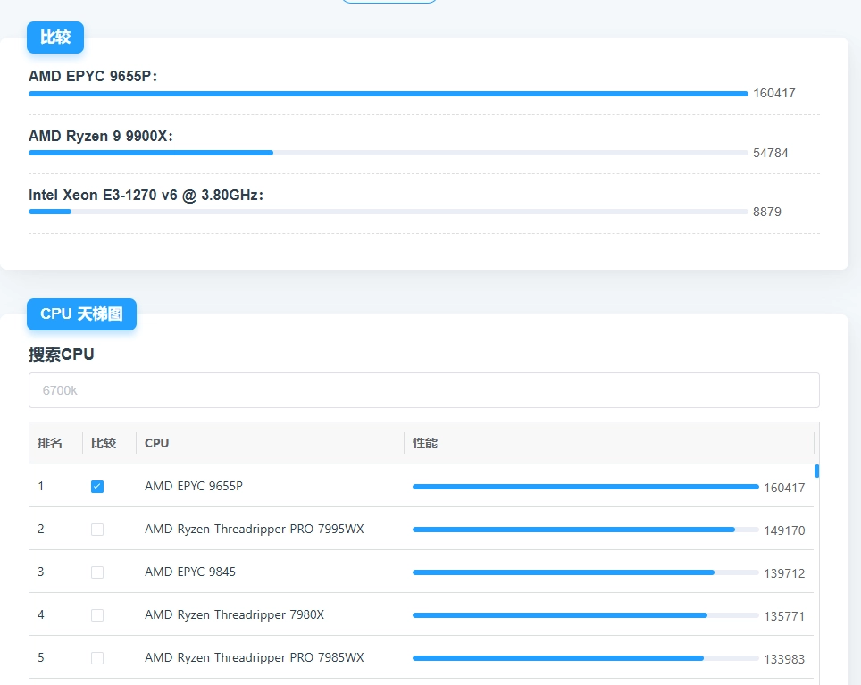

# The Complete VPS Guide: How to Choose the Perfect Virtual Private Server for Your Needs

---

Whether you're a solo developer, running a small business, or managing web applications, finding the right **Virtual Private Server (VPS)** can feel overwhelming. With countless providers, confusing specs, and varying price points, where do you even start? This guide cuts through the noise—walking you through VPS fundamentals, key selection factors, trusted providers, and common pitfalls to avoid.

---

# What Exactly Is a VPS, and What Can You Do With It?

**VPS stands for Virtual Private Server.** Think of it like this: a physical server gets sliced into multiple independent units through virtualization technology—similar to running virtual machine software on your computer. Each VPS gets its own operating system, storage, bandwidth, and allocated CPU and memory. You get near-dedicated-server performance without the shared hosting security headaches.

**Common VPS uses:**

- **Website hosting**: Perfect for medium-traffic blogs or business sites
- **Development and testing**: Isolated environments for deploying and testing code
- **Data storage and backups**: Secure storage for sensitive information
- **Private networks**: Remote work setups, game servers, or proxy configurations

---

# The Real Pros and Cons of VPS Hosting

### What Makes VPS Worth It:

**1. Total Customization**

Since your VPS has dedicated hardware and its own system, you can customize software and configurations to match your exact development needs.

**2. Budget-Friendly Performance**

VPS costs less than dedicated hosting but delivers way more power than shared hosting. It's that sweet spot between performance and price.

**3. Easy Scalability**

As traffic grows, you can quickly scale up CPU, memory, and storage without your site grinding to a halt from insufficient resources.

**4. Better Security**

Your VPS has its own CPU, memory, bandwidth, and disk space—no sharing. Unlike the open environment of shared hosting, VPS isolates sites from each other for added security. Plus, you can configure your own firewall for an extra security layer.

**5. Rock-Solid Reliability**

Since you're not sharing bandwidth with others, you get better reliability and uptime. Performance issues usually only crop up when you exceed bandwidth limits or pick an unreliable host.

### The Downsides You Should Know:

**1. Technical Know-How Required**

Managing and optimizing a VPS takes some technical chops. If you go with Linux (which most VPS run), the learning curve can be steep if you're used to Windows. Managed VPS options exist but cost more.

**2. Limited Hardware Control**

A VPS is still carved from a physical server's resources—you don't control the whole machine. Poor hardware configurations can impact your service performance.

**3. More Responsibility**

Most VPS providers won't offer tech support beyond physical server failures. You're responsible for daily management and performance optimization. When something breaks, you fix it.

---

# 6 Critical Factors for Choosing Your VPS

Once you understand what a VPS is and its trade-offs, here's what matters most when shopping for your first server:

**1. Price vs. Value**

- **Beware ultra-cheap traps**: "Dirt-cheap annual plans" often mean underpowered hardware or oversold servers that can't handle your workload.
- **Smart strategy**: 
  - **First-timers**: Try hourly-billed VPS like Vultr—test the waters before committing.
  - **Long-term users**: Annual plans save 20-40%, but stick with established providers to avoid shutdown risks.

**2. Performance Specs**

- **CPU cores**: 1 core handles light tasks; 4+ cores run databases or high-traffic sites smoothly.
- **RAM and storage**: Start with at least 2GB RAM + 40GB SSD.
- **Bandwidth and traffic**: Domestic providers often cap bandwidth (like 5Mbps); international hosts typically offer 1Gbps ports but limit monthly traffic (1TB/month is common).

**3. Location and Network Routes**

- **Domestic VPS**: Great for China-facing businesses, requires ICP filing, but delivers low latency.
- **International VPS**: No filing needed; for personal use, Japan or Singapore nodes work well (verify routes—some detour through the US, killing speeds). For global audiences, choose servers near your users.

**4. Provider Reputation and Support**

- **Skip sketchy small vendors**: If you can't find user reviews online, walk away. Small operations lack resilience when things go wrong.
- **Customer service matters**: Pick brands offering 24/7 ticket systems or live chat.

**5. Bonus Features**

- **Off-site backups**: Some providers include free backups; others charge extra. Off-site backups are safer.
- **One-click deployments**: Pre-installed control panels (like cPanel) or WordPress environments save setup time.

**6. Special Use Cases**

- **Storage servers**: Need massive disk space, not necessarily powerful CPU/RAM.
- **Streaming or proxy services**: Look for "native IPs" to avoid data center IP blocks (Netflix won't work otherwise).

If you're serious about reliable performance and want a provider that checks all these boxes, there's one name that keeps coming up in the VPS community. 👉 [Discover why thousands of developers trust BandwagonHost for rock-solid VPS hosting](https://bandwagonhost.com/aff.php?aff=79616)

---

# Top Value VPS Providers to Consider

For domestic China VPS, policy requirements mean real-name verification and website filing. Switching providers later requires transferring your filing—annoying. Stick with Alibaba Cloud or Tencent Cloud. Their new-user discounts are solid, and if renewal prices spike, just create a new account for fresh discounts.

International VPS offers way more freedom since no filing is required. The providers mentioned here are ones we've personally used and still run. Prices aren't rock-bottom, but stability and value have held up over the years.

Among international options, BandwagonHost stands out for its transparent pricing, consistent performance, and straightforward management interface—especially for users who want reliable service without complexity.

---

# VPS Shopping: Avoid These 6 Traps

When hunting for cheap VPS deals, price tags can cloud judgment. Keep these warnings in mind:

1. **"Unlimited traffic" gimmicks**: Often comes with bandwidth throttling or hidden caps on heavy usage.

2. **Test IP routes first**: Use tools like Ping.pe to check server latency and route stability before buying. Cheap plans may sneakily switch routes later.

3. **Back up your data**: Never rely solely on provider backups. Regularly back up critical files locally or across platforms. Small vendors often skip backups entirely.

4. **Read refund policies**: Prioritize providers offering 3-7 day unconditional refunds.

5. **Secure your setup**: Immediately configure SSH keys, firewall rules, and complex root passwords to prevent brute-force attacks.

6. **CPU model matters**: Two "1-core" VPS can perform wildly differently. An Intel E3-1270 v5 (4-core, 14nm Skylake) versus an AMD Ryzen 9 9900X (12-core, 4nm Zen 5) is night and day. Cheap VPS often run on outdated, retired hardware.

---

# Common Questions Answered

**Q1: What's the difference between VPS and cloud servers?**  
A: Cloud servers (like Alibaba Cloud ECS) run on distributed clusters for higher reliability; traditional VPS uses single-machine virtualization and costs less.

**Q2: Do domestic VPS require filing?**  
A: If you bind a domain and serve mainland users, yes. IP-only access doesn't require filing.

**Q3: How do I find affordable VPS?**  
A: Watch for new-user first-year discounts (Tencent Cloud offers 90% off), or try lesser-known but stable brands like RackNerd.

**Q4: Can I host multiple websites on one VPS?**  
A: Absolutely. One VPS can run multiple sites or services—it just depends on your server's performance capacity.

---

# Final Thoughts

Stop chasing "cheap and amazing"—that combo rarely exists. As a beginner, stick with the recommended providers in this guide, and you'll likely avoid disasters. Match your choice to your actual needs and budget. For business sites especially, go with established brands for better security and stability guarantees.

Once you get comfortable with VPS, control the impulse to buy every cheap deal you see. Those impulse purchases usually end up gathering digital dust. Focus on what you'll actually use, and you'll build a lean, effective server setup that serves you well for years. 👉 [Start your VPS journey with BandwagonHost's beginner-friendly plans](https://bandwagonhost.com/aff.php?aff=79616)
